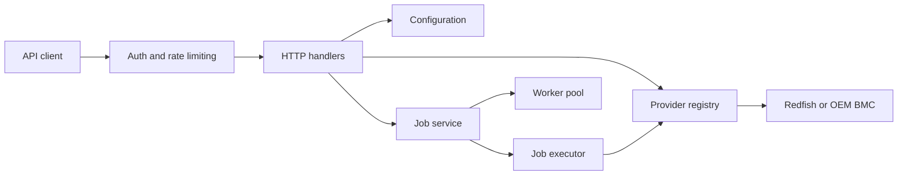

# MultiFish Design

This document describes the internal architecture and project structure of MultiFish. For installation and day-to-day operation, see [README.md](../README.md).

## Architecture Overview

MultiFish is a Go HTTP service for managing multiple BMC platforms through Redfish-compatible providers. The service is organized around five boundaries:

- HTTP handlers expose the Platform and JobService APIs.
- Providers translate platform operations into provider-specific Redfish or OEM calls.
- Configuration owns defaults, environment variables, YAML files, command-line overrides, and validation.
- The scheduler stores jobs, evaluates schedules, and dispatches actions through a worker pool.
- Middleware applies authentication and rate limiting before requests reach handlers.

```text
┌──────────────────────────────────────────────────────────────────┐
│                   REST API (Gin Framework)                       │
│      /MultiFish/v1/{Platform|JobService|Managers}                │
└────────────────┬─────────────────────────┬───────────────────────┘
                 │                         │
         ┌───────▼─────────┐       ┌───────▼───────────┐
         │  Platform Mgr   │       │  Job Scheduler    │
         │  (Connections)  │       │  (Automation)     │
         └───────┬─────────┘       └──────┬────────────┘
                 │                        │
                 │              ┌─────────▼────────────┐
                 │              │  Job Executor        │
                 │              │  (Worker Pools)      │
                 │              └─────────┬────────────┘
                 │                        │
         ┌───────▼────────────────────────▼─────────────┐
         │         Provider Registry                    │
         │  (Auto-detect BMC type and capabilities)     │
         └───────┬────────────────────────┬─────────────┘
                 │                        │
      ┌──────────▼────────┐     ┌─────────▼──────────┐
      │  Redfish Provider │     │  Extend Provider   │
      │  (Standard BMCs)  │     │  (OpenBMC + OEM)   │
      └──────────┬────────┘     └─────────┬──────────┘
                 │                        │
                 └──────────┬─────────────┘
                            │
                ┌───────────▼────────────┐
                │     BMC Hardware       │
                │  (Multiple Machines)   │
                └────────────────────────┘
```

**Architecture Highlights:**

- **API Layer**: RESTful endpoints following Redfish conventions
- **Platform Management**: Handles machine connections and discovery
- **Job Scheduling**: Time-based automation with worker pools
- **Provider System**: Pluggable architecture for different BMC types
- **Extensibility**: Easy to add new providers, actions, and features



## Request and Execution Flow

### Synchronous API requests

1. Gin receives the request and applies middleware.
2. The handler validates the path, payload, and platform or manager identity.
3. The provider registry resolves the provider for the requested platform.
4. The provider performs the Redfish or OEM operation.
5. The handler maps the result or error to the API response.

### Scheduled jobs

1. A job is validated and stored by the JobService.
2. The scheduler checks active jobs at its configured interval.
3. Due jobs are submitted to the worker pool.
4. The executor resolves the target platform and runs each action.
5. The job status and execution result are recorded and exposed through JobService endpoints.

A scheduled job must not block the HTTP server. Long-running work belongs in the scheduler worker pool, while handlers should validate input and return promptly.

## Project Structure

```text
.
├── main.go                         # Application entry point and server setup
├── go.mod                          # Go module definition
├── config/                         # Configuration package and example files
│   ├── config.go
│   ├── config.example.yaml
│   ├── config.production.yaml
│   ├── .env.production.example
│   └── README.md
├── handler/                        # HTTP API handlers and feature documentation
│   ├── handlePlatform.go
│   ├── handleManager.go
│   ├── handleJobService.go
│   ├── PLATFORM.md
│   └── JOBSERVICE.md
├── middleware/                     # Authentication and rate limiting
├── providers/                      # Provider registry and implementations
│   ├── generic_registry.go
│   ├── manager_provider.go
│   ├── redfish/
│   └── extend/
├── scheduler/                      # Job models, validation, execution, and workers
├── utility/                        # Shared errors, logging, helpers, and security
├── payloads/                       # JSON payload examples for API and jobs
├── examples/                       # Shell and Postman usage examples
├── service/                        # Service management script and systemd unit
├── docker/                         # Docker build definition
├── k8s/                            # Kubernetes manifests
├── tests/                          # Test helpers and test execution scripts
├── README.md                       # User-facing usage guide
└── docs/                           # Design, deployment, and security guides
        ├── DEPLOYMENT.md
        ├── SECURITY.md
        └── DESIGN.md
```

## Module Responsibilities

### `main.go`

Loads configuration, initializes logging and middleware, registers API routes, and starts the HTTP server. Application startup should remain small; feature behavior belongs in its owning package.

### `handler/`

Owns HTTP concerns: route parameters, request decoding, validation orchestration, response formatting, and API error handling. Platform and JobService behavior is documented in [handler/PLATFORM.md](../handler/PLATFORM.md) and [handler/JOBSERVICE.md](../handler/JOBSERVICE.md).

### `providers/`

Defines the provider boundary used by handlers and scheduled actions. The registry selects a provider by platform type, while concrete providers implement common Redfish operations or vendor-specific extensions. New provider behavior should be added behind this boundary rather than directly in handlers.

- `redfish/` contains the common Redfish manager implementation.
- `extend/` contains the extended provider and OEM-oriented operations.
- `generic_registry.go` owns provider registration and lookup.
- `manager_provider.go` defines shared provider-facing contracts.

### `scheduler/`

Contains job models, payload validation, schedule evaluation, execution, and worker-pool coordination. Actions should be represented as explicit job actions so they can be validated and executed consistently from both API requests and scheduled jobs.

### `middleware/`

Applies cross-cutting request policy before handlers run. Authentication and rate limiting are intentionally separate so deployments can configure them independently.

### `config/`

Resolves configuration in priority order: command-line flags, environment variables, YAML configuration, then built-in defaults. Validation belongs in the config package so all startup paths enforce the same rules.

### `utility/`

Provides shared error types, logging setup, security helpers, and small reusable functions. It should not own feature-specific business logic.

## Provider Extension Model

To add a provider capability:

1. Identify the common operation or define a provider-specific operation in the provider contract.
2. Implement the operation in the appropriate provider package.
3. Register or resolve the provider through the provider registry.
4. Expose it through a handler or scheduler action only after validation rules and error mapping are defined.
5. Add unit tests for the provider and handler behavior.

Handlers should depend on provider contracts, not on concrete Redfish client details. This keeps API behavior stable when provider implementations change.

## Job and Worker Model

The scheduler separates job lifecycle from action execution. Job validation happens before dispatch; the executor is responsible for running actions against the selected platform and reporting results. The worker pool bounds concurrent work so one large job set cannot consume unlimited goroutines or connections.

When changing scheduler behavior, cover these cases:

- invalid payloads are rejected before execution;
- jobs with future schedules remain pending;
- due jobs execute once per schedule occurrence;
- worker limits are respected;
- execution failures are observable in job status and logs;
- shutdown does not abandon accepted work without a defined result.

## Configuration Design

Configuration files are examples and deployment inputs, not package code:

- `config/config.example.yaml` is the development template;
- `config/config.production.yaml` is the production template;
- `config/.env.production.example` documents environment-based production values;
- `config/config.yaml` is the local runtime file created from a template and ignored by Git.

The service management script resolves the default runtime configuration from `config/config.yaml`. Explicit `-c` or `--config` values and `MULTIFISH_CONFIG` remain supported for deployments that keep configuration elsewhere.

## Testing Strategy

- Package tests cover configuration, middleware, handlers, providers, scheduler behavior, and utility functions.
- Handler tests should verify HTTP status, response shape, and validation failures.
- Provider tests should isolate external BMC behavior behind test doubles where possible.
- Scheduler tests should cover lifecycle, timing, worker-pool limits, and execution errors.

Run the complete suite with:

```bash
go test ./...
```

See [tests/README.md](../tests/README.md) for focused test commands and coverage helpers. Provider and scheduler details are documented in [providers/PROVIDER.md](../providers/PROVIDER.md) and [scheduler/SCEDULER.md](../scheduler/SCEDULER.md).
